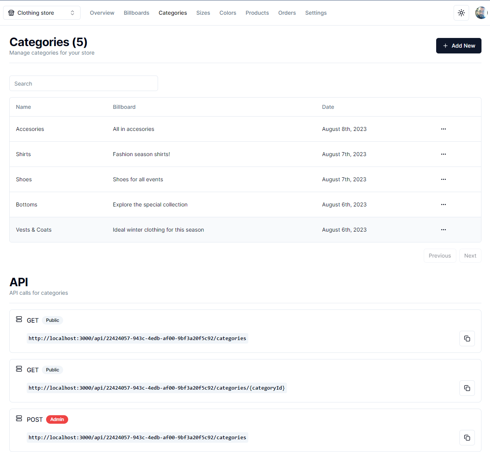
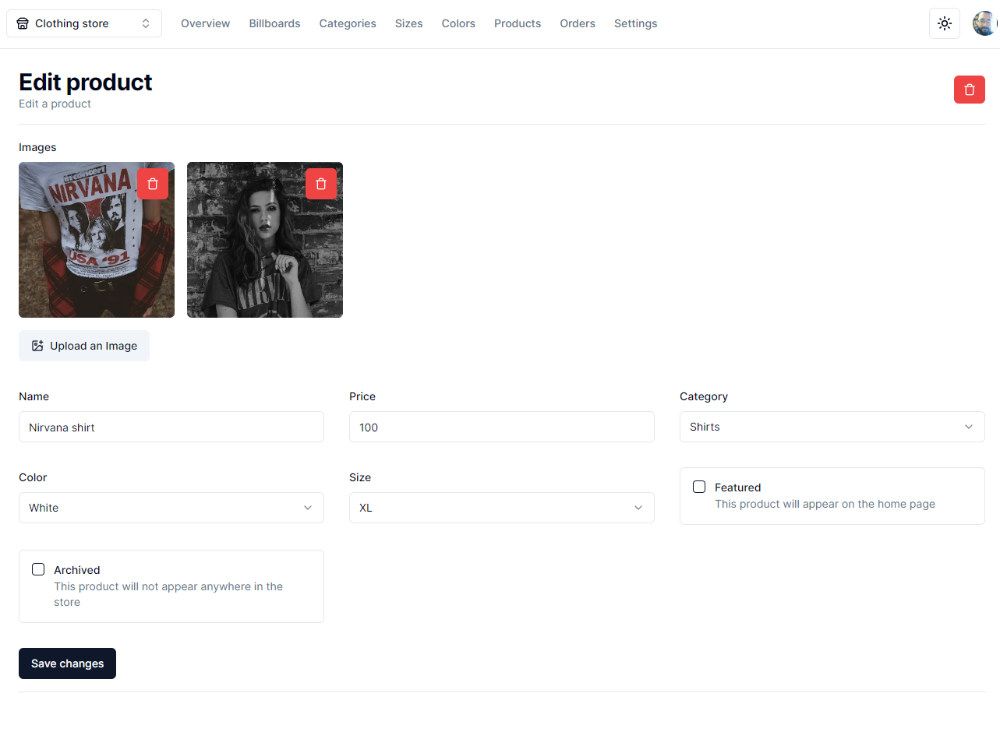
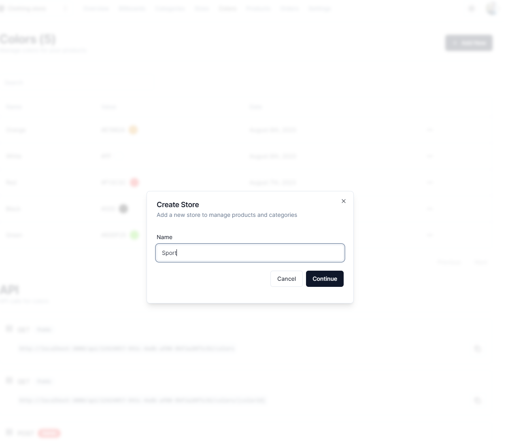
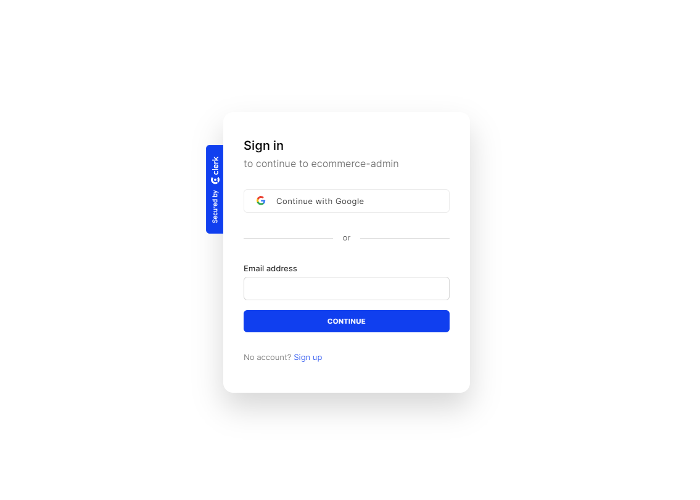
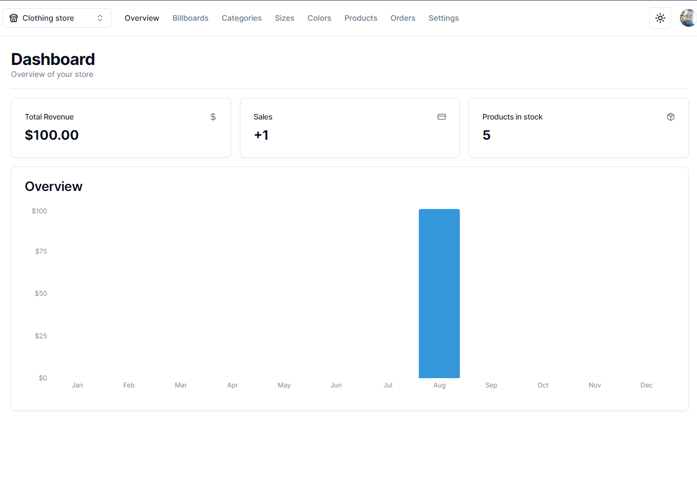

# ADMIN E-Commerce + Dashboard & CMS: Next.js 13 App Router, React, Tailwind, Prisma, MySQL

Thanks to the instructor Antonio!!

https://www.youtube.com/watch?v=5miHyP6lExg







- React
- NextJS 13
- shadcn/ui
- clerk (authentication)
- zustand
- prisma
- postgresql
- axios
- react-hot-toast
- next-cloudinary
- date-fns
- recharts
- next-themes
- stripe

```
npm run dev
```
